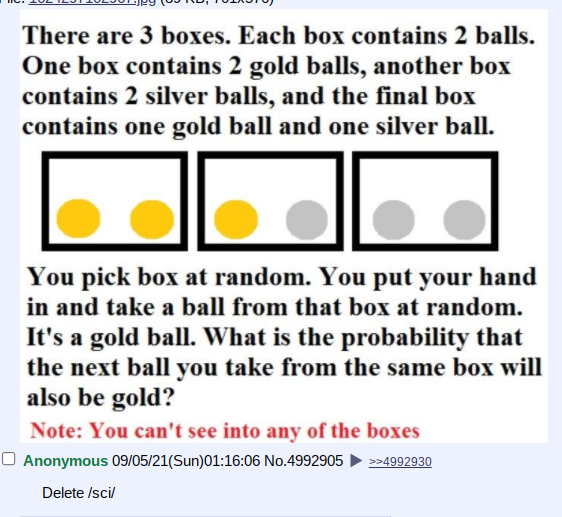

# Ball Experiment

## He was right

So basically I saw this challenge and gave the naïve (and wrong) answer of
50%. I remembered that it was basically a variant on the Monty Hall problem
and that even Erdős Pál didn't believe the solution until he was shown a Monte
Carlo simulation so I wrote my own for the following:



It only took me a few minutes:

```python
import random

def experiment():
    boxes = [['gold', 'gold'], ['gold', 'silver'], ['silver', 'silver']]
    box = random.choice(boxes)
    ball = box.pop(random.randint(0, 1))

    if ball == 'silver':
        return None
    else:
        return box.pop() == 'gold'

outcomes = list(filter(lambda outcome: outcome != None, [experiment() for _ in range(10000)]))
print(sum(outcomes) / len(outcomes))
```

Experimental outcomes like `0.6686771210293526` suggest a probability of
exactly two-thirds, just as in the original Monty Hall problem.
