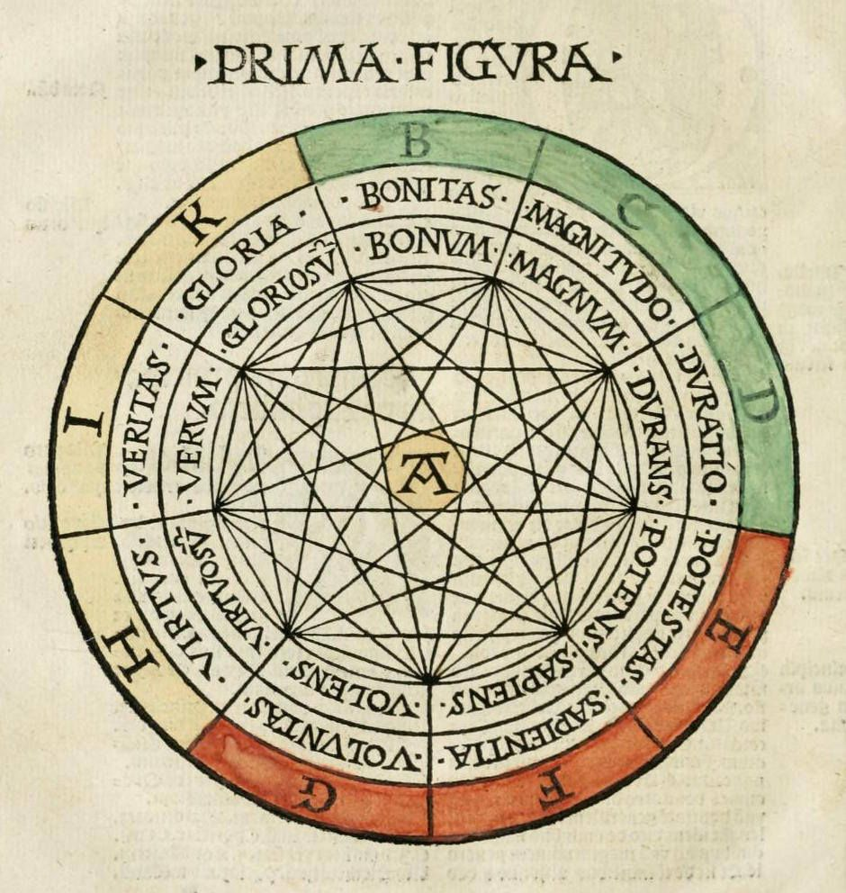

# Complete Graphs
## They look cool

Python libraries [NetworkX](https://networkx.github.io) and
[matplotlib](https://matplotlib.org) can be used to plot the [complete
graph](https://en.wikipedia.org/wiki/Complete_graph). With *n* equal to one,
it's a single point; with *n* equal to two, it's a line segment; with *n*
equal to three, it's a triangle, but things get more intricate from there.
With exceptionally large values of *n* (and an appropriate level of alpha that
"lets the light shine through", so to speak), the patterns begin to resemble
something like a mandala. This effect can be achieved like so, with *n* equal
to 50 and alpha equal to 0.25:

```python
import networkx as nx
import matplotlib.pyplot as plt
K = nx.complete_graph(50); pos = nx.circular_layout(K)
nx.draw_networkx(K, pos, with_labels=False, node_size=0, alpha=0.25); ax = plt.gca(); ax.set_axis_off(); plt.show()
```

Closely related operations have been joined with semicolons so that the
parameters of *n* and alpha can be experimented upon in a Python shell easily.
Here is the output of the above code, rendered this time not by `plt.show()`
but by `plt.savefig()` with a high DPI setting (720):


The aesthetic qualities of the complete graph apparently have been known for
hundreds of years, as demonstrated in this illustration from a 16th century
edition of medieval Catalan philosopher Ramon Llull's *Ars Magna*:


