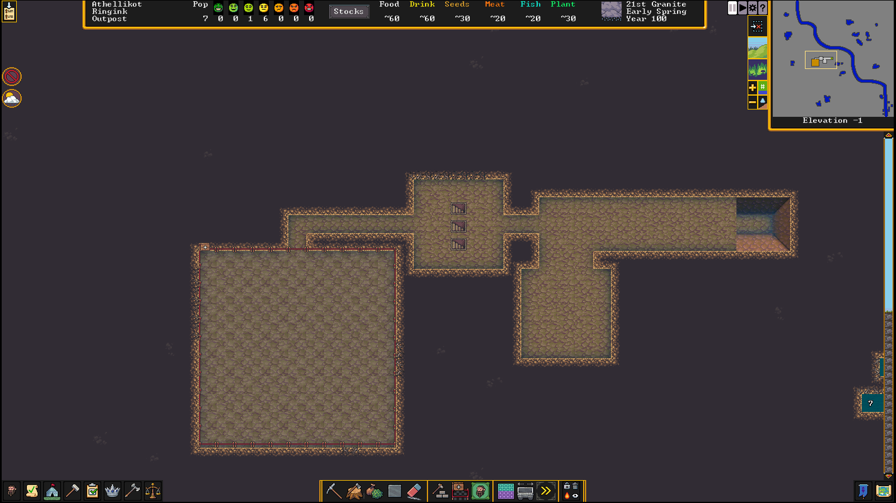
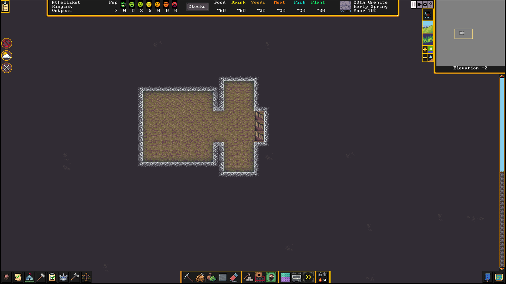
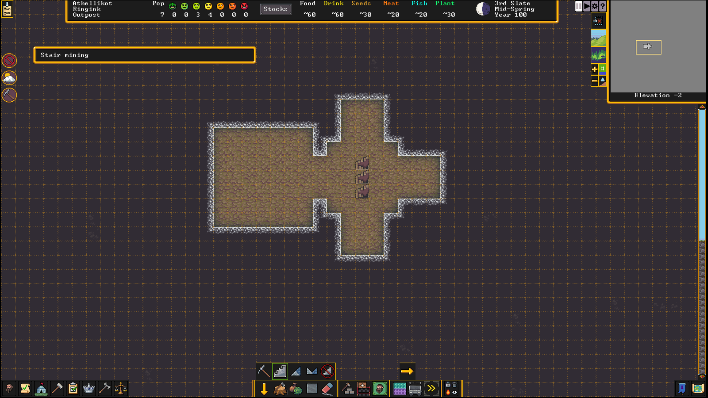

# Dwarf Fortress Notes

## Strike the earth

* A beginner should set "Number of Beasts" to "Low" and "Natural Savagery" to
"Very Low".
* (Light) aquifers are nearly impossible to avoid so it is best to figure out
how to deal with them.
* Other than that, one should look for:
  * "Woodland" or "Heavily Forested" (or, at the very least, "Sparsely
  Forested")
  * "Serene" or "Calm" surroundings or at least not an evil or savage biome
  * A river
  * In addition, these features help:
  * "Warm" or "Temperate" climate
  * "Clay", "Sand" or "Soil" for farming and pottery and glass production
  * Flux stone layer for steel industry (trading can ameliorate the lack
  thereof)
  * No bad neighbors nearby
  * On the same continent as an active Dwarven civilization
* Initially, set "Hunters" and "Fisherdwarves" to "Nobody does this" to avoid
lone Dwarves getting picked off by wildlife.
* The initial complement of tools includes three pickaxes so three Dwarves
should be assigned to mining duty. It may make sense to assign mining duty to
Dwarves who aren't initially very useful.
* The quickstart guide advises that custom labor details will need to be
created for certain types of labor such as "Wood Burning" and "Blacksmithing"
but doesn't give much detail on how these custom labor details should be
organized.
* Delving a 3x3 pit at the beginning, then digging out from there (at least 10
squares if not 20) will allow wagons to enter the uppermost reaches of the
fortress complex.
* There should be **ONLY** one entrance.
* When mining, press one of the direction keys to designate 10 squares in any
direction to be added to the current order.
* Forging more picks is necessary to make for more miners.
* Mining, woodcutting and hunting labors are mutually exclusive.
* The initial entry passage needs to be widened to three tiles about halfway
along its length, to admit trade wagons. From there, a three-tile-wide passage
way will need to be opened into a 5x5 trade depot off to one side. From there,
keep the entrance one tile wide for two tiles leading into a 5x5 main
stairwell area. From the main stairwell area dig a one-tile-wide hallway far
enough to dig a centered entrance to an 11x11 initial general stockpile area
(accepting everything but corpses, refuse, wood, stone and gems). It should
all look something like this: 
* Actually I've thought about it and I wanted to do something more like this,
which will enable me to set up a lot of traps: 
* In general, players seem to like hallways that are three tiles wide.
Three-wide staircases should also be adequate for all but the most extravagant
fortresses.
* The general stockpile should obviously not have trash and dead bodies but
wood and stone are to be kept out because they will quickly fill the
stockpile. (I guess the old Dwarf Fortress code where stockpiles had infinite
capacity is gone.) It's not clear to me yet why gems should be kept out.
* "While mining, take care to avoid digging into water. Dwarves are usually
poor swimmers, and are unlikely to escape from an underground flood. However,
it is safe to mine next to underground water, as long as you leave at least
one 'wall' tile between them (see the picture to the right). You can also mine
one z-level under a body of water (for example, mining under a river), but you
will have to designate each tile individually because DF automatically cancels
digging of newly-revealed 'damp' tiles (tiles are considered damp when they
are adjacent to a water tile, regardless of whether the water tile is on the
same z-level or not). Also note that water can flow diagonally."
* After creating the entrance hall I started the beginnings of hallways going
in the cardinal directions and a temporary meeting area, which should be at
least 5x5 to prevent animals from fighting in a crowded area. The picture
below shows what the area looks like after further development. There is a
meeting area in the southwest, a farming area in the northwest, a food and
drink workshop area in the northeast (with only a still currently) and a food
stockpile in the southeast. Note also that the temporary meeting area has what
will later become a well because I was able to dig down into the light aquifer
present in a controlled manner:

* Multiple zones can overlap, unlike stockpiles.
* Make a stockpile for refuse on the surface *at least* 5x5 in size. Refuse
is anything that can rot and the miasma thereof is not OK underground. Vermin
(Item Types → Remains) should apparently be disabled, as otherwise the refuse
stockpile will fill up quickly.
* Next thing will be establishing a farm. I carved out a 7x7 area initially,
though only a 3x3 area was initially used for farming therein. ("For a
reliable, long-term food and alcohol supply, you'll need to set up a farm. Dig
out a medium-sized room in a soil layer (including sand, clay, loam, silt,
peat, and ooze) accessible from inside your existing fortress. 5×5 is a good
size to start with, but you'll want to leave room to expand in at least one
direction. You must pick an underground area with mud or soil*. Placing this
near the stockpiles is more efficient, since farmers won't need to travel as
far.")
* Plump helmets are a good first crop. It is crucial to ensure that they will
be planted during all seasons because the default setting for each season is
to remain fallow.
* Dwarves will eat raw food.
* Consuming at least plump helmets results in more seeds and therefore more
planting opportunities available.
* Plant gathering and (I assume this should be a last resort) butchering the
initial supply of animals can be sources of emergency food.
* Create a small (let's say 15 tiles) stockpile on the surface near the
entrance for the initial wood supply and order a few trees to be cut down.
* "Drinks can be more problematic than food, since they require more
preparation (except for water, that is). In warmer weather, you can specify a
"water source" activity zone around a lake or river on the surface to keep
your dwarves from dying of thirst, but dwarves deprived of alcohol slow down
and become unhappy. In addition, drinking outside can be dangerous — dwarves
running outside constantly risk running into wild animals, or worse. Creating
a still to brew alcohol is the simplest solution to these problems."
* "To brew drinks, click on the still, click 'Add new task', and 'Brew drink
from plant'. **This will not work yet**, since you don't have any empty
barrels or rock pots, but you should start brewing in the first six months
(see Calendar and Status)."
* Create an initial pasture area on the surface about 10x10 to ensure that the
initial complement of animals doesn't starve.
* "While this guide recommends a vertical fortress design around a central
stairwell, with each z-level being used for a particular purpose, it is not
really that important to use this design for your first fortress. Therefore,
feel free to put any of the areas described in the rest of this guide on your
main level or wherever you want as long as dwarves can get to them without
going outside the fort. In other words, you can think of the 'levels'
described in the guide more as areas that can really all be on the same level
if you have space. Later you can ponder over what makes things most efficient,
but for now just do whatever you find easiest. Note that you may need to dig
down a bit to get to stone if you have more than one z-level of sand/clay/soil
below the surface."
* "Dig space for your workshops off of the stairwell. It will hold your
mechanic's, stoneworker's, carpenter's, and jeweler's workshops. Something to
consider is stockpile proximity: the farther away the material is the dwarves
use, the more time they waste with walking. So for now, dig out some more
space for stockpiles close to where your new workshops will be (wood for your
carpenter, stone for your stoneworker and mechanic, and gems for your
jeweler)."
* Here's what the beginnings of a workshop floor look like for me. The
workshops mentioned above have been built and there are two stone stockpiles,
one wood stockpile, one gems stockpile and a yet unused finished goods
stockpile:

* Use hotkeys to access frequently used areas.
* "(Dwarves already busy mining or hauling may not immediately stop to
construct workshops; if you like, you may temporarily disable other labors in
order to jumpstart workshop construction.) If the construction of any building
gets 'suspended' click on the workshop and click 'Resume construction' to
unsuspend it. (This can happen if another dwarf or object is blocking the way.
See Garbage Dumping below if you find you need to remove an object.)"
* It appears that certain labors fall under multiple skills, such as the
"Stoneworker's workshop": "The workshop can be made out of any building
material and requires any of the stoneworker labors: stone carving,
stonecutting, stone engraving and even masonry which isn't even used at the
workshop."
* The "Places" menu can be used to see where completed workshops are and the
"Task information" menu can be used to find where incomplete ones are.
* "You'll need barrels to store drinks for your dwarves. Queue up two or three
barrels in your carpenter's workshop. (If you run out of wood at any point,
cut down another tree or two outside)."
* Dwarves can't grow more trees without either mods or cheesing the game but
it is possible to acquire materials harvested from trees through trade.
* Managers are required for more sophisticated control of workshops.
* "At this point, it is a good idea to build a few wheelbarrows to make
hauling large objects (particularly stone) more efficient. Queue up 2 or 3 at
the carpenter's workshop. (Wheelbarrows are located near the bottom of the
list, you will need to scroll all the way down.) While the wheelbarrows are
being built, click on your stone stockpile and click the barrel icon, and
increase 'Max wheelbarrows' to 3. Your dwarves will automatically move
wheelbarrows to the stockpile once they are built."
* Furniture does not count towards "Finished goods" and could be added to a
"Finished goods" stockpile.
* "Certain labors are crucial in setting up a fort. At some point you may want
to disable less important labors such as hauling for dwarves with the crucial
skills of mining, masonry, architecture, carpentry, mechanics, and maybe
others. You want these dwarves working on creating beds, doors, and trap
components before hauling stone and cleaning."
* "**Note that garbage is not the same thing as refuse.** Refuse is rotting
stuff. Garbage is anything you designate to be hauled to a garbage dump, even
important things that aren't really garbage. Think of your garbage dump zone
as a way to specify that objects you select will be brought to a specific
area."
* "Press z, click on 'Garbage Dump', and create a 1×1 activity zone somewhere
near your stoneworker's and mechanic's workshops. Unlike stockpile areas where
you are limited to storing one object per tile, any number of items may be
piled in a garbage area. That means you will only need one tile to hold as
much 'garbage' as you like. Although many of the room sizes in this guide are
suggestions, think of the 1×1 garbage dump size as mandatory. At some point
you will probably want to retrieve an important item from your garbage dump,
and the more tiles your dump contains, the harder it will be to find anything
in it."
* "Press i-p to select the mass dump/forbid tool. Select a rectangle over the
loose stones cluttering up your living area (if there are any – this often
isn't a problem yet if you've built your fort in a soil layer). This will
designate this stone to be transported to a garbage dump zone. Be sure not to
designate the stone in your stockpiles by mistake, since that will only cause
your dwarves to perform unnecessary hauling. Once the stone from your living
area has been moved there, it will be set as forbidden. Before it can be used
you will need to unforbid it using i-F (or just i)."
* "Note that dwarves hauling stone (or any large, heavy objects) move slowly,
and can take a lot of time to reach their destination. This can be a major
waste of time if you designate 50 boulders to be dumped at once. Unless the
stone is in the way of something, you don't *need* to dump it every time you
dig out a new area."
* "Stones lying on the ground don't slow dwarves down at all. If there is a
particular dwarf you don't want hauling "garbage", use the labor menu (y) and
select the "Haulers" work detail. From there you can select certain dwarves
that you want to haul items. By default, Haulers is set to "Everybody does
this". You might want to exclude Miners from hauling, since they are far more
useful when digging than when moving the stone they just dug out."
* A bunch of animals with a chicken leg thought bubble appeared in my
temporary meeting place and had to be assigned to the pen I created.
* Build a trade depot in the 5x5 area dug out in the beginning of the game.
* "This is where caravans will park their stuff and where trading will take
place when one arrives. (as stated earlier, the wagons are 3×3 so the entrance
tunnel needs to be at least 3×3 for the wagons to go by)."
* Cut gems and finished goods (and the like) are decent trade items at the
start.
* Good items to trade for at the beginning include:
  * Food
  * Booze
  * Livestock
  * Seeds/spawn
  * Picks
  * Barrels
  * Wood
  * Bags
  * Rope and bucket (for a well)
  * An anvil (presumably just one, if needed)
  * Cloth (all three kinds)
  * Gems
  * Leather
  * Sand
  * Metal ores and bars in addition to metal items which can be melted down
  and reused.
* "The happier you make a merchant, the less profit margin they will demand in
a trade. Dwarven merchants start off wanting about 100% profit, maybe a little
more. If you repeatedly offer less than what they expect, that will 'lower'
their mood. If, on the other hand, you meet or exceed their expectation, that
will, over several trades, improve their mood. If merchants reach the lowest
level, no further trade will be possible, and they will immediately pack up
and leave your depot. Since annoyed merchants are more likely to reject deals,
you should be generous in initial negotiations. Skilled negotiators seem less
likely to offend merchants with unsuccessful deals."
* Initially it will be necessary to send some random Dwarf to deal with
merchants until you have a dedicated broker.
* "Unless you are looking for extra fun, ***under no circumstances*** should
you offer or attempt to trade elves any items which involve wood, dead
animals, or wood or animal products, or which used wood or animal parts at any
step in their creation*, including decorations. If you do not respect this
cultural prohibition, the elves will immediately take offense, refuse that
trade, end the entire trading session, and leave, possibly damaging relations
enough to provoke a war between you and the elven civilization you traded
with. (* e.g. This includes clear glass and crystal glass items, which require
pearlash to produce, which in turn comes from potash, which itself is produced
by burning a log. Similarly, yarn and wool are unwelcome. Yes, they are that
picky about it.)"
* It may be necessary to go digging into bins or other containers to bring
items to a trade depot.
* Elves don't mind you using wooden containers for trading **IF** the
containers themselves are not offered as part of a deal.
* When new arrivals come, be sure to alter work details as needed.
* The remains of deceased Dwarves should be interred to prevent miasma (and
worse) from happening. Tomb zones are for individuals only, not mass burial.
* "Keep in mind that cooking plants destroys their seeds, or in this case
their 'spawn'. Both eating a plant raw and brewing it will leave plump helmet
spawn behind, which can then be transferred to a seed bag, then planted and
used to grow more. New players should definitely farm this crop because it
grows relatively quickly, can be planted in any season, may be used to make
alcohol, or eaten raw if need be."
* "Up to this point, your dwarves have probably been sleeping on dirt or rock
in your fortress. While this is fine for a short time, your dwarves will
gradually become less happy if they are forced to sleep without a bed."
* "In general, try to keep the bedrooms close to the stairs, and make your
access hallways at least two tiles wide to reduce congestion."
* "Monster Slayers" can be turned into citizens by going into their "Labor"
tab, then "Locations" and hitting the red checkbox. They can't be used in a
military role until gaining full citizenship.
* Blocks are very useful for construction as each boulder will make four
lighter blocks that can each be used instead of a boulder. However, boulders
remain necessary for a number of crafting tasks.
* "Poor soil" close to the surface is a sign for you to do farming on the
surface or, better yet, in a cavern.
* Stone tiles can be irrigated by digging a channel above them, marking the
channel as a pond and waiting for the water to spread. The pond can be removed
once that process is done as no further irrigation is necessary.
* Caverns can be a good source of fungal wood.
* Extensively walling off extensive regions of cavern floors seems to be very
error-prone.
