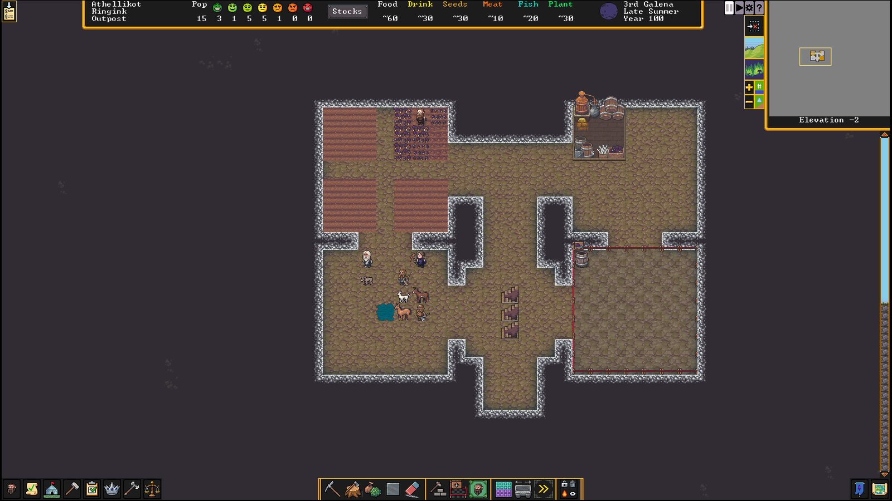

# Dwarf Fortress Notes

## Strike the earth

* A beginner should set "Number of Beasts" to "Low" and "Natural Savagery" to
"Very Low".
* (Light) aquifers are nearly impossible to avoid so it is best to figure out
how to deal with them.
* Other than that, one should look for:
  * "Woodland" or "Heavily Forested" (or, at the very least, "Sparsely
  Forested")
  * "Serene" or "Calm" surroundings or at least not an evil or savage biome
  * A river
  In addition, these features help:
  * "Warm" or "Temperate" climate
  * "Clay", "Sand" or "Soil" for farming and pottery and glass production
  * Flux stone layer for steel industry (trading can ameliorate the lack
  thereof)
  * No bad neighbors nearby
  * On the same continent as an active Dwarven civilization
* Initially, set "Hunters" and "Fisherdwarves" to "Nobody does this" to avoid
lone Dwarves getting picked off by wildlife.
* The initial complement of tools includes three pickaxes so three Dwarves
should be assigned to mining duty. It may make sense to assign mining duty to
Dwarves who aren't initially very useful.
* The quickstart guide advises that custom labor details will need to be
created for certain types of labor such as "Wood Burning" and "Blacksmithing"
but doesn't give much detail on how these custom labor details should be
organized.
* Delving a 3x3 pit at the beginning, then digging out from there (at least 10
squares if not 20) will allow wagons to enter the uppermost reaches of the
fortress complex.
* There should be **ONLY** one entrance.
* When mining, press one of the direction keys to designate 10 squares in any
direction to be added to the current order.
* Forging more picks is necessary to make for more miners.
* Mining, woodcutting and hunting labors are mutually exclusive.
* The initial entry passage needs to be widened to three tiles about halfway
along its length, to admit trade wagons. From there, a three-tile-wide passage
way will need to be opened into a 5x5 trade depot off to one side. From there,
keep the entrance one tile wide for two tiles leading into a 5x5 main
stairwell area. From the main stairwell area dig a one-tile-wide hallway far
enough to dig a centered entrance to an 11x11 initial general stockpile area
(accepting everything but corpses, refuse, wood, stone and gems). It should
all look something like this: 
* In general, players seem to like hallways that are three tiles wide.
Three-wide staircases should also be adequate for all but the most extravagant
fortresses.
* The general stockpile should obviously not have trash and dead bodies but
wood and stone are to be kept out because they will quickly fill the
stockpile. (I guess the old Dwarf Fortress code where stockpiles had infinite
capacity is gone.) It's not clear to me yet why gems should be kept out.
* "While mining, take care to avoid digging into water. Dwarves are usually
poor swimmers, and are unlikely to escape from an underground flood. However,
it is safe to mine next to underground water, as long as you leave at least
one 'wall' tile between them (see the picture to the right). You can also mine
one z-level under a body of water (for example, mining under a river), but you
will have to designate each tile individually because DF automatically cancels
digging of newly-revealed 'damp' tiles (tiles are considered damp when they
are adjacent to a water tile, regardless of whether the water tile is on the
same z-level or not). Also note that water can flow diagonally."
* After creating the entrance hall I started the beginnings of hallways going
in the cardinal directions and a temporary meeting area, which should be at
least 5x5 to prevent animals from fighting in a crowded area. The picture
below shows what the area looks like after further development. There is a
meeting area in the southwest, a farming area in the northwest, a food and
drink workshop area in the northeast (with only a still currently) and a food
stockpile in the southeast:

* Multiple zones can overlap, unlike stockpiles.
* Make a stockpile for refuse on the surface *at least* 5x5 in size. Refuse
is anything that can rot and the miasma thereof is not OK underground. Vermin
(Item Types → Remains) should apparently be disabled, as otherwise the refuse
stockpile will fill up quickly.
* Next thing will be establishing a farm. I carved out a 7x7 area initially,
though only a 3x3 area was initially used for farming therein. ("For a
reliable, long-term food and alcohol supply, you'll need to set up a farm. Dig
out a medium-sized room in a soil layer (including sand, clay, loam, silt,
peat, and ooze) accessible from inside your existing fortress. 5×5 is a good
size to start with, but you'll want to leave room to expand in at least one
direction. You must pick an underground area with mud or soil*. Placing this
near the stockpiles is more efficient, since farmers won't need to travel as
far.")
* Plump helmets are a good first crop. It is crucial to ensure that they will
be planted during all seasons because the default setting for each season is
to remain fallow.
* Dwarves will eat raw food.
* Consuming at least plump helmets results in more seeds and therefore more
planting opportunities available.
* Plant gathering and (I assume this should be a last resort) butchering the
initial supply of animals can be sources of emergency food.
* Create a small (let's say 15 tiles) stockpile on the surface near the
entrance for the initial wood supply and order a few trees to be cut down.
* "Drinks can be more problematic than food, since they require more
preparation (except for water, that is). In warmer weather, you can specify a
"water source" activity zone around a lake or river on the surface to keep
your dwarves from dying of thirst, but dwarves deprived of alcohol slow down
and become unhappy. In addition, drinking outside can be dangerous — dwarves
running outside constantly risk running into wild animals, or worse. Creating
a still to brew alcohol is the simplest solution to these problems."
* "To brew drinks, click on the still, click 'Add new task', and 'Brew drink
from plant'. **This will not work yet**, since you don't have any empty
barrels or rock pots, but you should start brewing in the first six months
(see Calendar and Status)."
* Create an initial pasture area on the surface about 10x10 to ensure that the
initial complement of animals doesn't starve.
* "While this guide recommends a vertical fortress design around a central
stairwell, with each z-level being used for a particular purpose, it is not
really that important to use this design for your first fortress. Therefore,
feel free to put any of the areas described in the rest of this guide on your
main level or wherever you want as long as dwarves can get to them without
going outside the fort. In other words, you can think of the 'levels'
described in the guide more as areas that can really all be on the same level
if you have space. Later you can ponder over what makes things most efficient,
but for now just do whatever you find easiest. Note that you may need to dig
down a bit to get to stone if you have more than one z-level of sand/clay/soil
below the surface."
* "Dig space for your workshops off of the stairwell. It will hold your
mechanic's, stoneworker's, carpenter's, and jeweler's workshops. Something to
consider is stockpile proximity: the farther away the material is the dwarves
use, the more time they waste with walking. So for now, dig out some more
space for stockpiles close to where your new workshops will be (wood for your
carpenter, stone for your stoneworker and mechanic, and gems for your
jeweler)."
* Here's what the beginnings of a workshop floor look like for me. The
workshops mentioned above have been built and there are two stone stockpiles,
one wood stockpile, one gems stockpile and a yet unused finished goods
stockpile:

* Use hotkeys to access frequently used areas.
